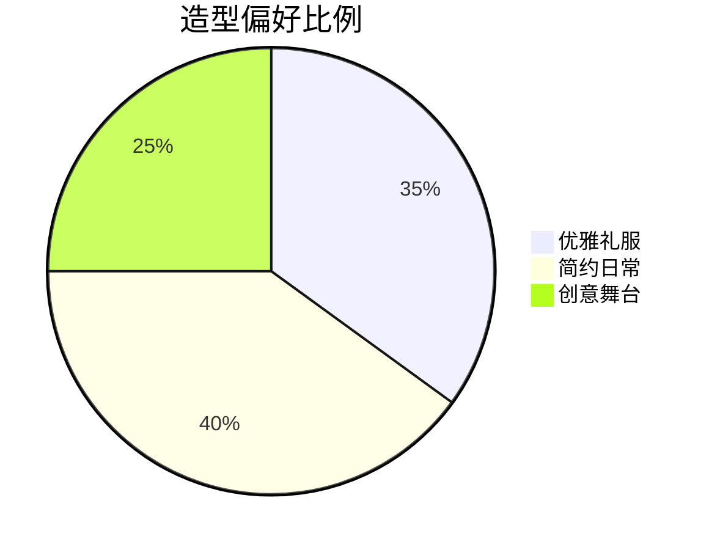

# 数据科学笔记

> "望"

---

## 📌 个人档案
```csv
姓名,
昵称,CYY
生日,
星座,射手座
代表作品,生气
```

---

## ❤️ 喜欢的理由
### 个人特质
- ✨ **独特气质**：兼具古典优雅与现代活力
- 💡 **才华横溢**：在[具体领域]展现非凡才能
- 🌟 **人格魅力**：很善良

### 成长历程
1. 🎓 **教育背景**：[香港城市大学/应用社会科学]
2. 🏆 **重要成就**：[王者荣耀/最强王者]
3. 🚀 **近期动态**：[在准备面试]

---

## 📚 经典语录
> "米米都" —— CYY

> "那你想让我怎么做" —— CYY

---

## 📸 视觉记忆
### 造型集锦


### 场景回忆
- 🎬 [具体事件]：[时间+地点+感受]
- 📚 [相关作品]：[作品名称+观后感]

---

## 📅 互动记录
### 粉丝里程碑
```gantt
    title 追随历程
    dateFormat  YYYY-MM-DD
    section 关键时刻
    初识        :done, 202X-01-01, 1d
    首次见面    :active, 202X-06-15, 1d
    特别纪念日  :202X-12-25, 1d
```

---

## 🌐 扩展链接
- [微博主页](https://weibo.com/) 🔗
- [豆瓣主页](https://douban.com/) 🔗
- [个人官网](https://example.com/) 🔗

---

## 📝 更新日志
- 2024-03-15 ✏️ 初稿创建
- 2024-03-16 🎨 添加可视化图表
- 2024-03-17 💬 补充经典语录
```

---

使用说明：
1. 将`待补充`部分替换为实际信息
2. 图片链接可替换为真实照片URL
3. 使用`Ctrl+K`+`Ctrl+C/V`快速添加代码块
4. 在支持Markdown的编辑器（如Typora/VSCode）中打开效果最佳

如果需要特定方向的扩展（如学术成就/作品集/旅行足迹），可以告诉我具体需求，我会为您补充相应模块！
